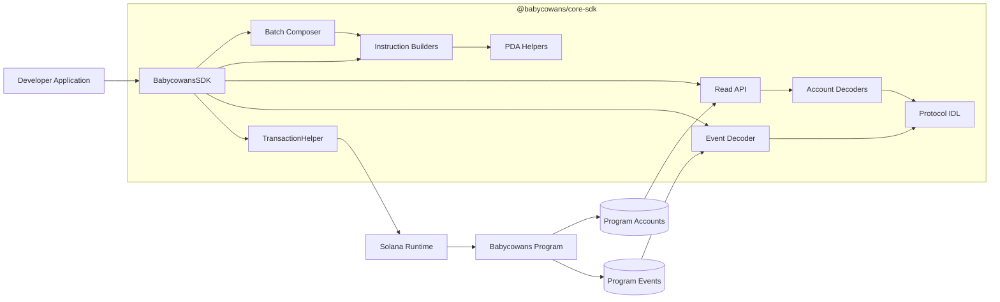
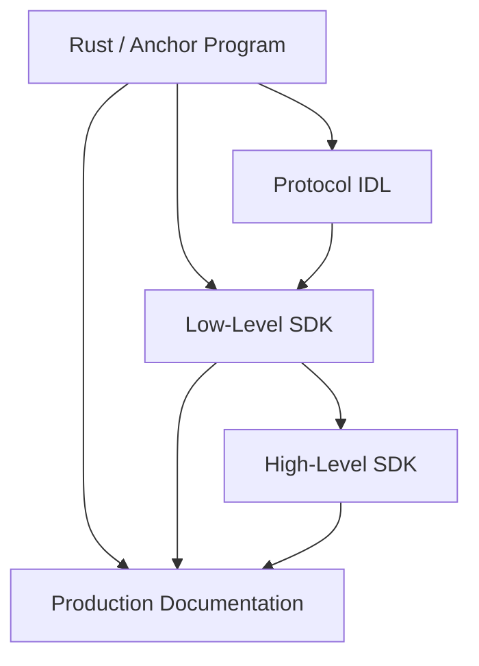
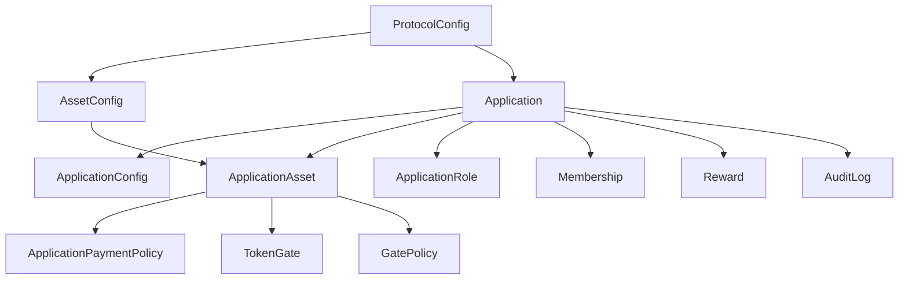
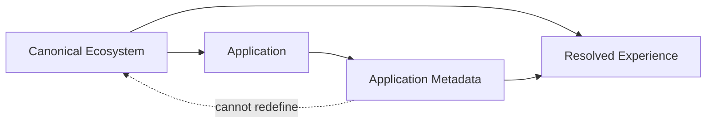
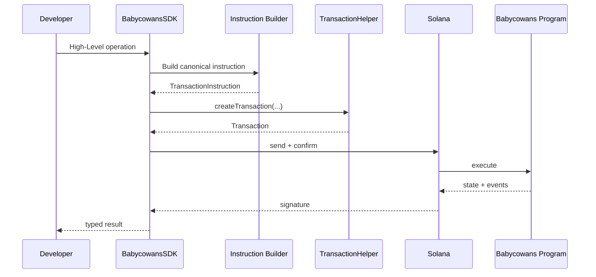
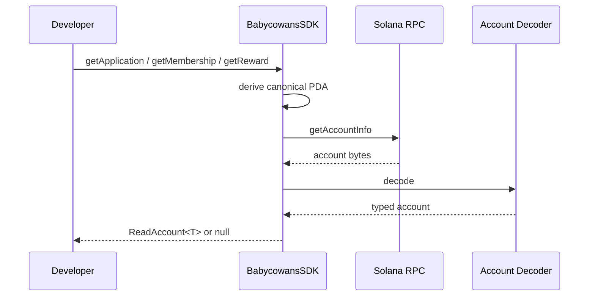
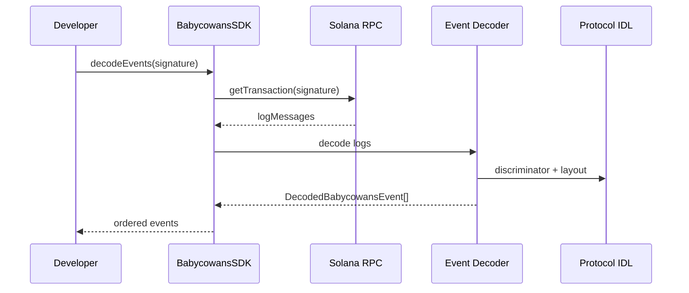
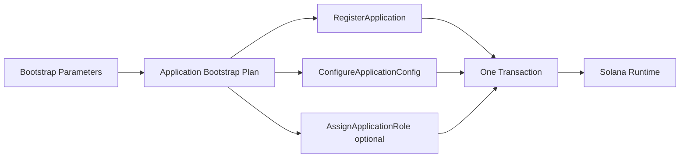
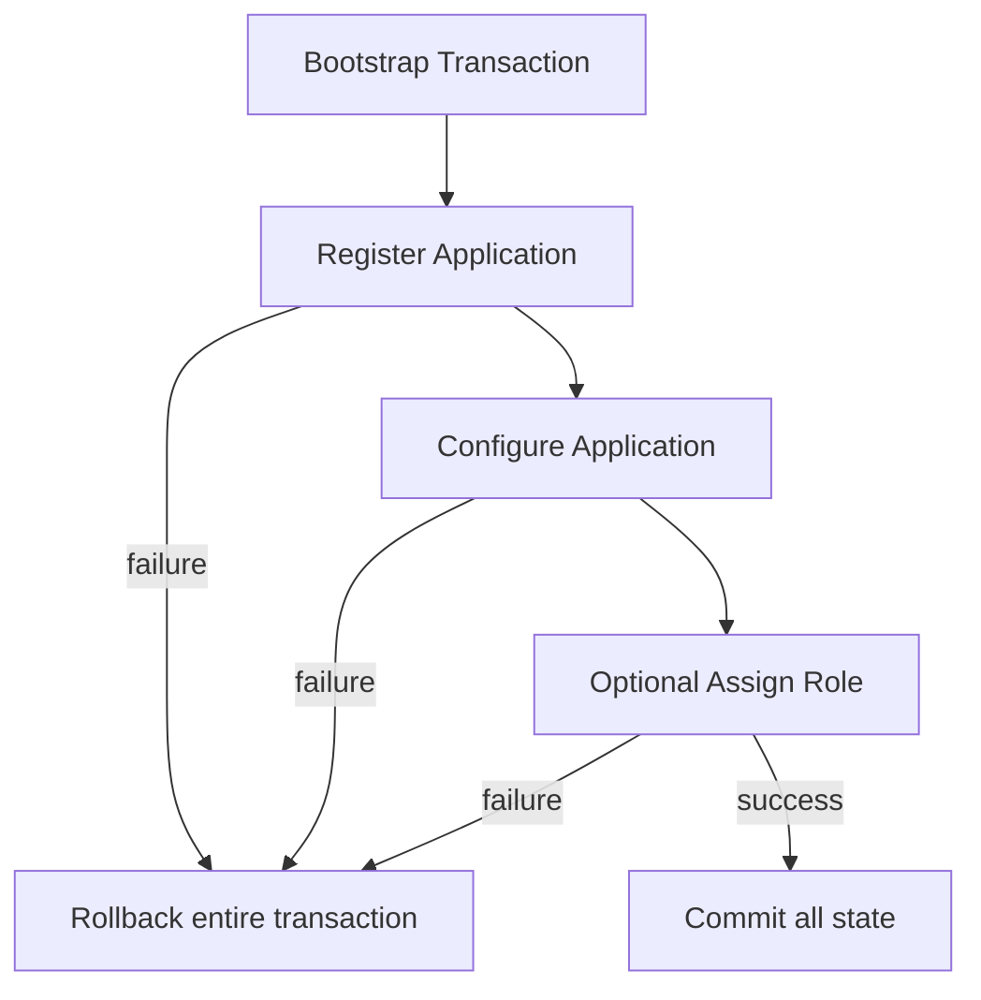

# Babycowans Architecture

This document describes the architecture of **Babycowans Protocol V1.0.0** and `@babycowans/core-sdk`.

## 1. System overview



## 2. Architectural rule

The SDK follows:

```text
High-Level Developer API
          ↓
Existing Low-Level SDK Primitives
          ↓
Protocol Source of Truth
```

High-Level APIs should not duplicate:

- PDA rules;
- instruction encoding;
- account layout;
- event schema.

## 3. Source-of-truth hierarchy



Documentation is downstream of protocol and SDK implementation.

## 4. Main account model



This diagram expresses integration dependencies. It is not intended to replace Rust account constraints.

## 5. PDA model

The SDK exposes deterministic helpers for:

```text
ProtocolConfig
AssetConfig
Application
ApplicationConfig
ApplicationAsset
PaymentPolicy
ApplicationRole
Membership
Reward
TokenGate
AuditLog
GatePolicy
```

Use SDK PDA helpers rather than duplicating seed strings.

## 6. Canonical identity boundary



Canonical identity includes:

```text
Full Name
Ticker
Token Address
Mission
```

Application metadata remains application-owned information.

## 7. Write architecture



## 8. Read architecture



Audit history uses a program-account query and returns deterministic application-scoped results.

## 9. Event architecture



The decoder:

- scopes to the configured Babycowans program;
- recognizes current IDL discriminators;
- preserves ordering;
- preserves `PublicKey`;
- preserves relevant integers as `bigint`;
- ignores unrelated logs;
- supports strict malformed-payload handling.

## 10. Batch architecture



Canonical instruction order:

```text
1. RegisterApplication
2. ConfigureApplicationConfig
3. optional AssignApplicationRole
```

## 11. Atomic rollback



No partial Application / ApplicationConfig bootstrap state survives a failed transaction.

## 12. SDK layers

```text
BabycowansSDK
│
├── High-Level write operations
├── Read API
├── Event Decoder integration
├── Application Bootstrap Batch
│
└── Existing primitives
    ├── instruction builders
    ├── PDA helpers
    ├── account decoders
    ├── ecosystem registry
    ├── metadata resolvers
    ├── IDL
    └── TransactionHelper
```

The Low-Level SDK remains publicly usable.

## 13. Integer fidelity

Protocol values backed by `u64` or `i64` may exceed JavaScript's safe integer range.

Relevant SDK models preserve these values as `bigint`.

Do not silently coerce arbitrary protocol `bigint` values to `number`.

## 14. PublicKey fidelity

Solana addresses remain `PublicKey` objects inside typed SDK models where address behavior matters.

Convert to Base58 only at external presentation or serialization boundaries.

## 15. Failure boundaries

Integrations should distinguish:

```text
Input / Builder Error
RPC Transport Error
Transaction Simulation Error
On-chain Anchor Error
Account Decoder Error
Event Decoder Error
Metadata Resolution Error
```

Do not collapse every failure into one generic application error when retry or diagnosis depends on the actual layer.

## 16. Compatibility principle

Babycowans Protocol V1.0.0 should evolve through compatible additions wherever practical.

For integration-sensitive assumptions, prefer:

1. current SDK types;
2. current IDL;
3. current Rust definitions;

over copied documentation fragments.

See [MIGRATION.md](MIGRATION.md).
